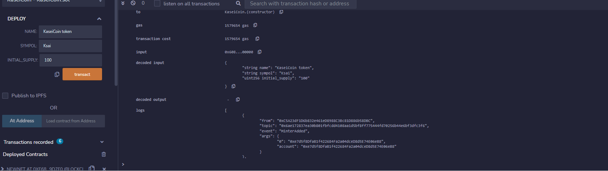
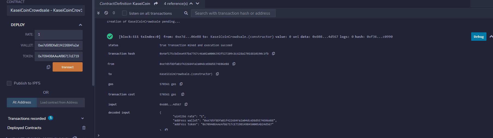
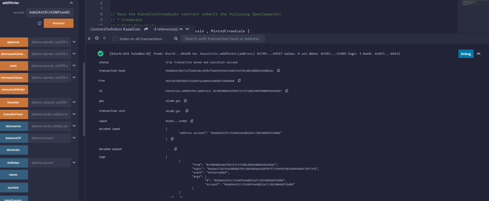
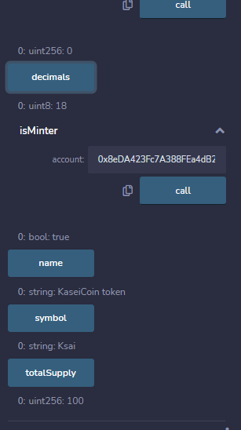

# Token-Crowdsale

### Three Solidity smart contracts are used in this prototype project to allow people relocating to Mars to convert their earthly money into KaseiCoin, a planned new cryptocurrency. The KaseiCoin would be an ERC-20 compliant fungible coin with a crowdsale for currency conversion.

----------
### Technologies
 Ganache, Remix IDE, and MetaMAsk
 
 ----
 ### Files 
 [KaseiCoinCrowdsale.sol](KaseiCoinCrowdsale.sol)
 
 [KaseiCoin.sol](KaseiCoin.sol)
 
 
 [Evaluation_Evidence](Evaluation_Evidence)
 
 ------------
 ### Background
 The  two contracts are produced when the KaseiCoinCrowdsaleDeployer contract is deployed, and they can be loaded using their contract addresses. The "Demo" section below contains instructions on how to deploy and load smart contracts. Users can acquire fresh tokens for recipient addresses and check the balances of their accounts once the KaseiCoin and KaseiCoinCrowdsale smart contracts have been loaded. They may also see the entire supply of minted tokens and the amount of wei raised via the crowdsale contract.
 
#### The other two contracts are created whenever the KaseiCoinCrowdsaleDeployer contract is deployed, and they can be loaded using their contract addresses. The "Deployment" section below contains instructions on how to deploy and load smart contracts. Users can acquire fresh tokens for recipient addresses and check the balances of their accounts once the KaseiCoin and KaseiCoinCrowdsale smart contracts have been loaded. Users should also see the entire supply of minted tokens and the amount of wei raised via the crowdsale contract.
------
### Demo
Deploying the KaseiCoin Contract& KaseiCoinCrowdsale

### Adding the Crowdsale contract address as Minter 

#### Checking the Total Supply

